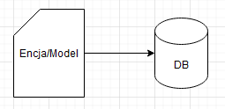

# Data-Service

## Założenia i opis

Serwis danowy zapewnienia abstrakcję modeli danych, które użytkownik może wprowadzać do systemu. Modele mają być
skrojone pod jego aktualne potrzeby gwarantując niemal optymalne działanie. Serwis danowy przechowuje jedynie dane
biznesowe z pominięciem danych funkcjonalnych (jak dane formularzy, procesów itp)

Przykładowym modelem bazowym może być Klient (Customer):

```kotlin
open class Customer {
    open var id: Long?
    open var name: String?
    open var alias: String?
    open var taxNumber: String?
    open var projects: MutableList<Project>?
}
```

Model bazowy powinien spełniać następujące zasady:

- zawierać minimalną ilość pól
- zawierać tylko te pola, które są niezbędne do zapewnienia potrzebnej funkcjonalności
- wszelkie rozszczerzenia modelu powinny być realizowane przez dodanie relacji

Serwis danowy udostępnia metadane swoich zaimplementowanych modeli w następującej postaci:

```json
[
  {
    "name": "id",
    "type": "Long",
    "constraints": [
      "Id"
    ],
    "multiplicity": "SINGULAR"
  },
  {
    "name": "name",
    "type": "String",
    "constraints": [],
    "multiplicity": "SINGULAR"
  },
  {
    "name": "alias",
    "type": "String",
    "constraints": [],
    "multiplicity": "SINGULAR"
  },
  {
    "name": "taxNumber",
    "type": "String",
    "constraints": [],
    "multiplicity": "SINGULAR"
  },
  {
    "name": "projects",
    "type": "List<prodactivvity.Project>",
    "constraints": [],
    "multiplicity": "PLURAL"
  }
]
```

Metadane modelu opisują wszystkie udostępnione do odczytu/zapisu pola wybranego modelu (w tym przykładzie jest to
Customer). Każde pole zawiera nazwę, typ, listę ograniczeń oraz w przypadku relacji jej krotność.

Ograniczenia nałożone na dane pole wynikają bezpośrednio z potrzeby biznesowej, które dany model ma realizować.

Wszelkie zmiany wprowadzane do modelu powinny być starannie przemyślane i oparte na potrzebach biznesowych, aby nie
wprowadzać niepotrzebnych skomplikowań i utrudnień w korzystaniu z serwisu.

## Rozwój

Rozwój serwisu w głównej mierze opiera się o definiowanie nowych modeli lub rozszerzanie istniejących. Przed wdrażaniem
jakichkolwiek zmian, należy w pierwszej kolejności sporządzić diagram relacji i zweryfikować jego poprawność. Trzeba
pamiętać aby zmiany, które będą wprowadzane nie wpływały na zmianę działania istniejących rozwiązań. Tworząc nowe modele
należy się starać aby spełniały 3NF.

### Dodanie modelu - technicznie

Należy model umieścić w odpowiadającym mu module funkcjonalności, czyli w odpowiednim pakiecie, np.: organization,
invoices itp. Pozwala to zachować porządek i grupuje modele według funkcji, które realizują. Model należy dodać jako
osobną klasę Kotlinową z zachowaniem następujących zasad:

- Zawsze oznaczamy model adnotacją `@Entity`
- Klasa musi być “otwarta” `open class Task`
- Dla wartości ID zawsze definiujemy generator sekwencji np.:

```kotlin
@Id
@GeneratedValue(strategy = GenerationType.SEQUENCE, generator = "Task_GEN")
@SequenceGenerator(name = "Task_GEN", sequenceName = "Task_SEQ")
open var id: Long? = null
```

- Każde pole w modelu musi być `open` oraz `nullable` z domyślną wartością `null`
  (jest to wymóg nałożony przez Framework, tylko w ten sposób współpracuje z Kotlinem i jego podejściem `nullsafe`
- Do każego pola można dodać opcjonalne, niestandardowe adnotacje, nakładajace dodatkowe ograniczenia na model:
    - `@NotInsertable` - wybrane pole nie może dynamicznie tworzyć nowych obiektów
    - `@Required` - wybrane pole jest obowiązkowe

Przykład nowego modelu:

```kotlin
@Entity
open class Task {
    @Id
    @GeneratedValue(strategy = GenerationType.SEQUENCE, generator = "Task_GEN")
    @SequenceGenerator(name = "Task_GEN", sequenceName = "Task_SEQ")
    @Column(name = "id", nullable = false)
    open var id: Long? = null

    @field:Required
    open var name: String? = null

    @Lob
    open var description: String? = null

    open var orderedOn: LocalDateTime? = null

    open var deadline: LocalDateTime? = null

    @ManyToOne
    @JoinColumn(name = "orderer_id")
    @field:Required
    @field:NotInsertable
    open var orderer: AppUser? = null

    @ManyToOne
    @JoinColumn(name = "performer_id")
    @field:Required
    @field:NotInsertable
    open var performer: AppUser? = null

    @ManyToOne
    @JoinColumn(name = "customer_id")
    @field:NotInsertable
    open var customer: Customer? = null

    @ManyToOne
    @JoinColumn(name = "project_id")
    open var project: Project? = null
}
```

Pole `ordere` jest oznaczone niestandardową adnotacją `@NotInsertable` co informuje, że np.: z wykorzystaniem formularza
w tym polu nie można dynamicznie utworzyć nowego użytkownika i można wybrać jedynie z pośród istniejących użytkowników.

## Abstrakcja modeli - koncepcje

Mam dwa pomysły na realizację tego serwisu, oba mają wady i zalety, niżej opisuję co i jak. Temat jest do dyskusji.

### Koncepcja prostsza

Ta koncepcja zakłada, że modele biznesowe opisujemy od razu na modelu bazodanowym. Czyli tak jak jest opisane wyżej.
Model na którym pracują aplikacje i użytkownicy są bezpośrednim odwzorowaniem bazy danych. Czyli są to klasy oznaczone
jako `@Entity`. Takie rozwiązanie ma następujące zalety:

- prostsza implementacja, czyli prostsze dodawanie nowych modeli - ograniczamy się jedynie do dodania modelu,
  zdefiniowania repozytorium oraz implementacji ProQL
- prostsze pobieranie i zapis danych - realizowane w głównej mierze poprzez Hibernate’a i automatycznie generowane
  zaptania SQL

ale ma też wady:

- z biegiem czasu takie rozwiązanie może się okazać nieoptymalne, z powodu automatycznego generowania zapytań SQL



### Koncepcja optymalniejsza

Ta koncepcja zakłada dodanie jeszcze jednej warsty modeli DTO nad warstwą opisu modeli bazodanowych - encji. Pozwoli to
bardziej elastycznie modelować obiekty potrzebne do realizacji problemu biznesowego, poprzez brak ścisłego powiązania z
samą encją. Dzięki temu jedna encja może być optymalniej wykorzystywana do przechowywania danych. Przykładowo
pole `deadline` w encji `Task` może być przez DTO A wykorzystywane jako `deadline` a przez DTO B
jako `project_deadline`.


Zalety tego rozwiązania:

- większa elastyczność modelowania danych,
- reużywalność encji,
- pełniejsze wykorzystanie atrybutów encji bez względu na charakter problemu biznesowego
- mozliwość zapewnienia niestandardowych metod pobierania danych z bazy - ominięcie automatyzacji Hibernate’a,
- optymalniejsze zapytania SQL do bazy.

Wady tego rozwiązania:

- bardziej skomplikowane tworzenie modeli i encji,
- konieczność ręcznego pisania SQL’i (tylko raz przy tworzeniu DTO i repozytorium) przez programistę.

## Komunikacja z innymi mikroserwisami

Serwis danowy komunikowac może się jedynie z serwisem Formularzy, który odpowiada za zapewnienie bezpiecznych
interfejsów dodawania i edycji danych. Na daną chwilę serwis nie powinien być udostępniony nigdzie indziej.

### Komunikacja z serwisem Formularzy

Aktualnie komunikacja opiera się o RestAPI co nie jest najlepszym rozwiązaniem, ale na ten moment jest wystarczające.

### Cacheowanie metadanych

Najistotniejsze dane które serwis danowy udostępnia serwisowi Formularzy to metadane modeli. Metadane modeli mają to do
siebie, że podczas działania aplikacji pozostają niezmienne. Można zatem pomysleć o współdzielonym cache’u tych danych,
tak aby nie męczyć zbędnie aplikacji i zapewnić natychmiastowy dostęp do tych danych. Moja propozycja to postawić np.:
Redisa i udostępnić go obu serwisom


## Lista zadań do realizacji

1. Przegadać koncepcje opisane wyżej z biznesem - im szybciej tym lepiej. do PoC’a możemy zostać z aktualnie
   zastosowanym podejściem nie będzie to miało większego wpływu na wydajność póki co.
2. Opisać zasady działania `ProQLQuery` i `ProQLCommand`
3. Zadbać o observability serwisu i bazy danych
4. Zaimplementować cachowanie metadanych modeli